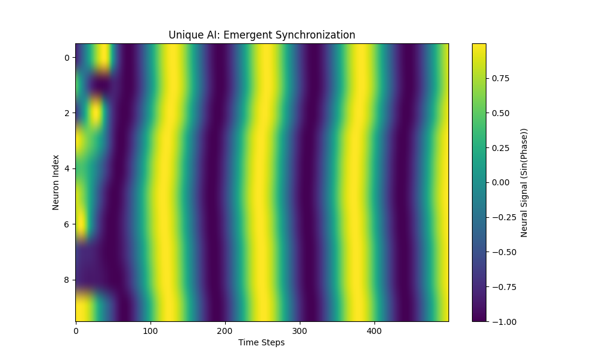
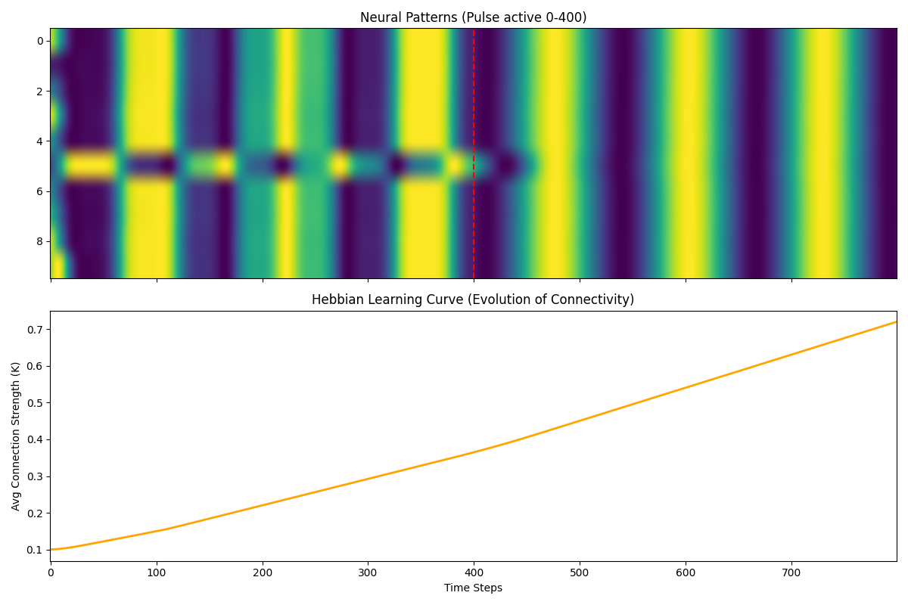
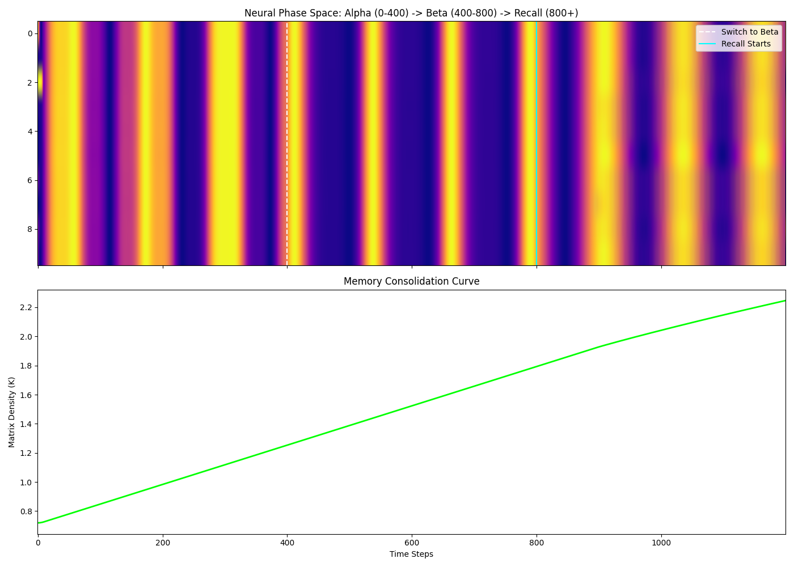
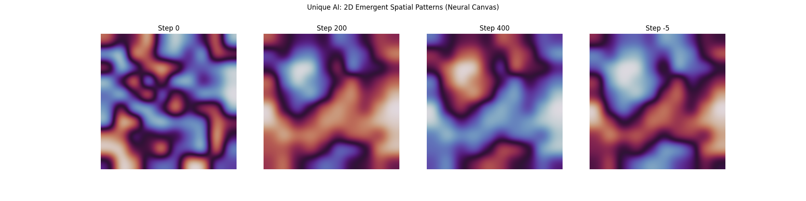
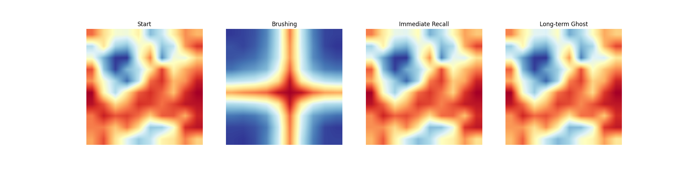
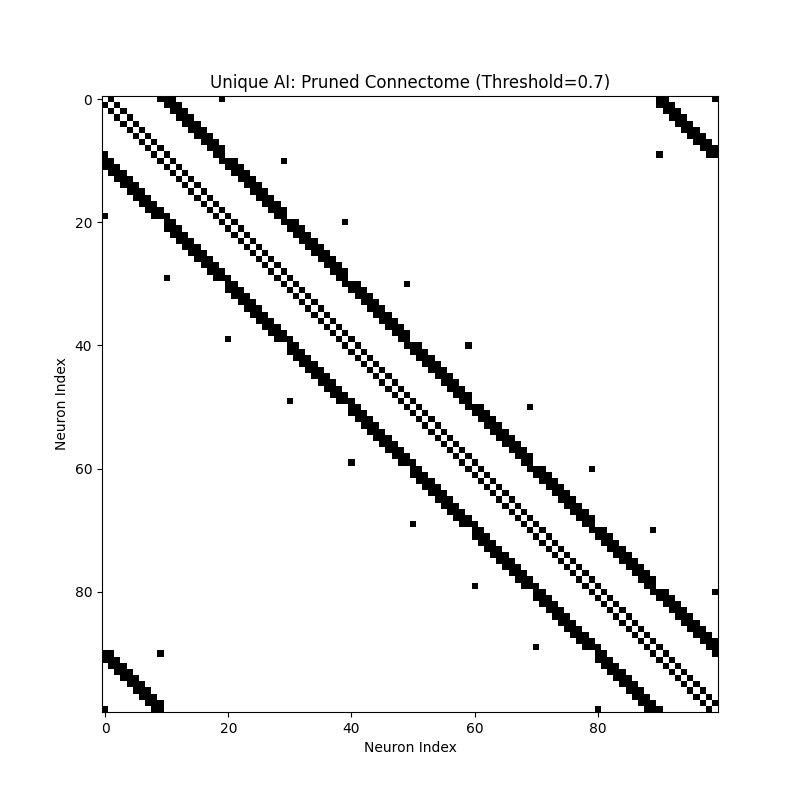

# Artist Algorithm Design: Neural Sculptures
This repository showcases a unique AI architecture developed through **Phase Resonance** and **Hebbian Pruning**, bypassing standard backpropagation.

## Evolution of a Thought
| Stage | Visualization | Description |
| :--- | :--- | :--- |
| **0. Synchronization** |  | 10 oscillators finding a shared rhythm. |
| **1. Entropy** |  | Resilience to noise with increased coupling. |
| **2. Hebbian Learning** |  | Connections strengthen based on co-activity, adapting to external rhythms. |
| **3. Associative Memory** |  | The network learns and recalls multiple rhythmic patterns. |
| **4. Neural Canvas** |  | Emergent 2D spatial patterns, showing collective 'thought'. |
| **5. Sculpting Memory** |  | Imprinting a 'brushstroke' pattern onto the neural canvas. |
| **6. Pruning Sculpture** |  | Pruning away weak connections to reveal the 'sculpted' neural architecture, representing the learned memory. |
| **7. Temporal Prediction** | *(Visual Missing)* | Predicting the trajectory of a moving stimulus. |
| **8. Predictive Anticipation** | *(Visual Missing)* | A second layer 'anticipates' sensory input, generating predictions. |
| **9. Prediction Error** | *(Visual Missing)* | Detecting and responding to unexpected sensory events. |
| **10. Active Inference (Motor Tracking)** | *(Visual Missing)* | The AI actively moves its 'body' to track and minimize prediction error. |
| **11. Selective Attention** | *(Visual Missing)* | Focusing on one stimulus amidst competing inputs. |
| **12. Dopamine Reward** | *(Visual Missing)* | Learning through reward signals to reinforce successful behaviors. |
| **13. Metabolic Constraint** | *(Visual Missing)* | Simulating energy limitations and their impact on neural activity. |

## Installation & Usage
No special installation, just run the Colab notebook!

## License
MIT License - Feel free to explore and build upon this unique AI concept!
