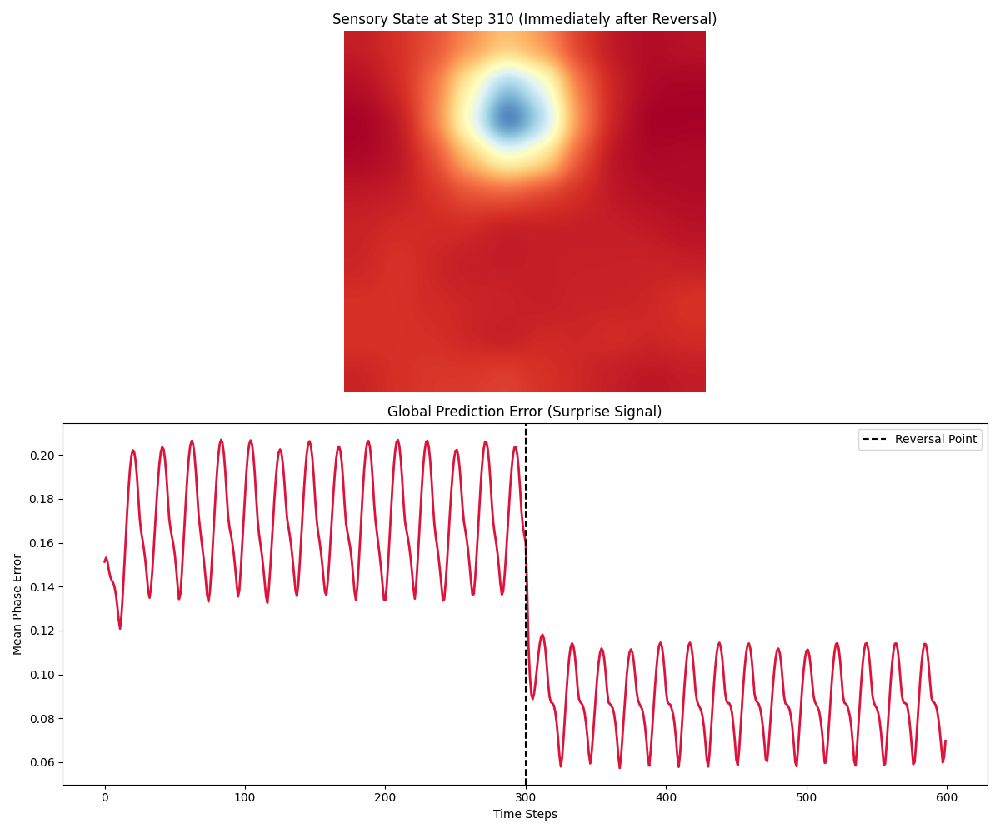
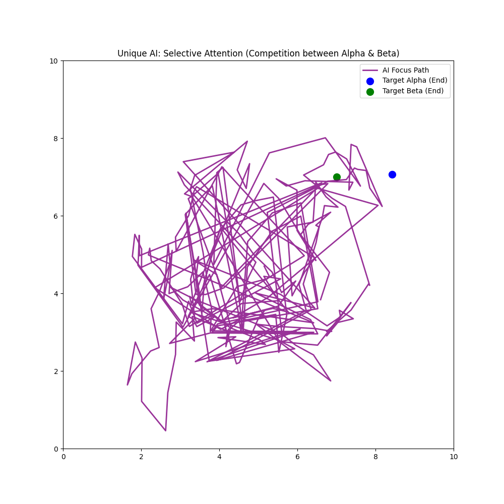

# Artist Algorithm Design: Neural Sculptures
This repository showcases a unique AI architecture developed through **Phase Resonance** and **Hebbian Pruning**, bypassing standard backpropagation.

## Evolution of a Thought
| Stage | Visualization | Description |
| :--- | :--- | :--- |
| **0. Synchronization** |  | 10 oscillators finding a shared rhythm. |
| **1. Entropy** |  | Resilience to noise with increased coupling. |
| **2. Hebbian Learning** |  | Connections strengthen based on co-activity, adapting to external rhythms. |
| **3. Associative Memory** |  | The network learns and recalls multiple rhythmic patterns. |
| **4. Neural Canvas** |  | Emergent 2D spatial patterns, showing collective 'thought'. |
| **5. Sculpting Memory** |  | Imprinting a 'brushstroke' pattern onto the neural canvas. |
| **6. Pruning Sculpture** |  | Pruning away weak connections to reveal the 'sculpted' neural architecture, representing the learned memory. |
| **7. Temporal Prediction** |  | The pruned sculpture anticipates a moving stimulus. |
| **8. Predictive Anticipation** |  | Dual layers show a 'predictive' layer leading the 'sensory' layer. |
| **9. Prediction Error** |  | A 'surprise signal' when predictions fail (e.g., stimulus changes direction). |
| **10. Motor Tracking** |  | The AI's 'motor' system actively follows a predicted target. |
| **11. Selective Attention** |  | The AI focuses on one of two competing external stimuli. |
| **12. Reinforcement Learning** |  | Reward-modulated plasticity (Dopamine) strengthens beneficial connections. |
| **13. Metabolic Constraints** |  | System dynamics constrained by a finite 'energy' reserve, leading to inhibition when energy is low. |

## Installation & Usage
No special installation, just run the Colab notebook!

## License
MIT License - Feel free to explore and build upon this unique AI concept!
